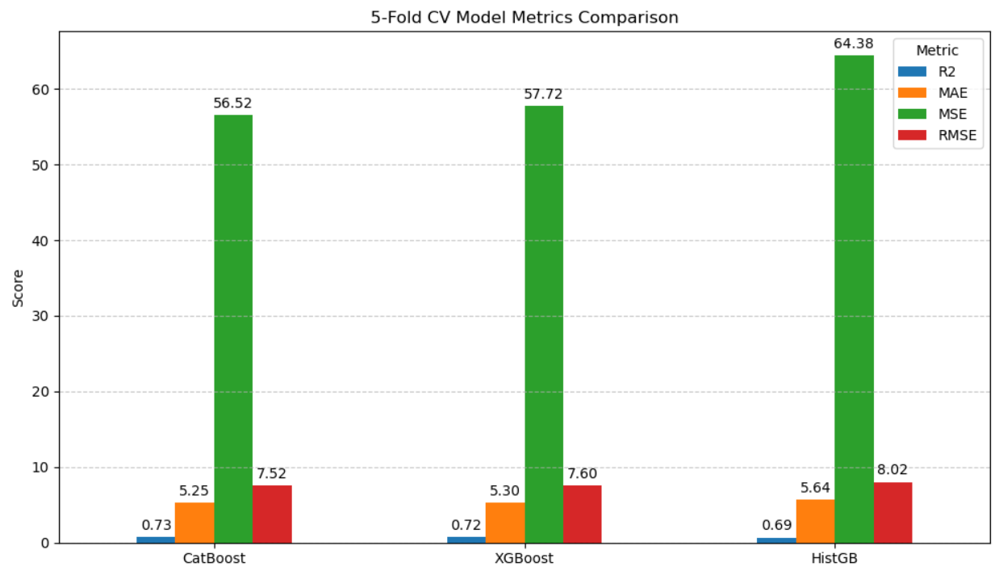
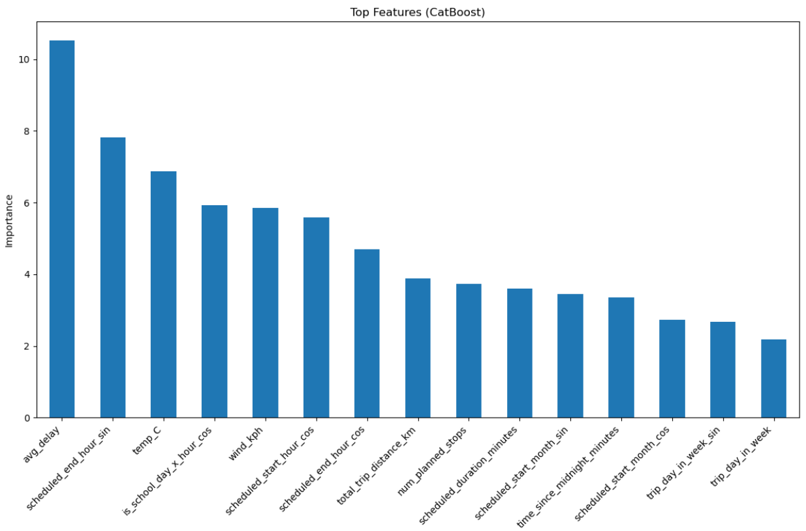

# Tel-Aviv Latency Prediction with Weather and Historical Data

This project focuses on predicting trip delays in Tel-Aviv using a combination of weather data, historical trip information, and engineered cyclical features. 

These visualizations highlight the project's core achievements:
the Model Performance Comparison showcases the evaluation of different machine learning models, 
while the Feature Importance plot reveals the key factors driving predictions.
Together, they demonstrate the approach in predicting trip delays based only on data known in advanced.
## Project Overview
### Model Performance Comparison:

### Feature Importance

## Feature Engineering

### Cyclical Features
Some features, such as time and month, exhibit cyclical patterns. For example:
- December (12) is closer to January (1) than May (5).
- Hours and minutes repeat cyclically throughout the day.

To preserve these properties, I use sine and cosine transformations normalized by $$ \frac{2\pi}{\text{max_value}}*value \ $$. This ensures the model captures the cyclical nature of these features, leading to better performance.

### Aggregated Features
- **`avg_speed`**: The average speed for each route is calculated based on historical trip data. This feature provides insights into typical travel speeds for different routes, helping the model account for variations caused by traffic and road conditions.
- **`avg_delay`**: The average delay for each route is computed using historical data. This feature captures the reliability of specific routes and helps the model predict delays more accurately.
- **`is_rush_hour`**: A binary feature indicating whether the trip occurred during rush hours (e.g., 7-9 AM, 4-7 PM). This feature helps the model understand the impact of peak traffic times on trip delays.
- **`is_school_day`**: A binary feature indicating whether the trip occurred on a school day. This feature accounts for the influence of school schedules on traffic patterns and trip delays.
### Weather Features
Weather conditions, such as temperature, precipitation, and wind speed, are included to account for their significant impact on trip delays. For instance:
- Rain or strong winds can slow down traffic and increase delays.
- Extreme temperatures may affect vehicle performance or passenger behavior.

By incorporating weather data, the model gains a more comprehensive understanding of external factors influencing trip delays, leading to improved predictions

### Feature Categories
The dataset includes the following feature types:

#### Categorical Features
- `ClusterId`
- `Direction`
- `LineAlternative`
- `route_route_short_name`
- `route_route_type`
- `route_direction`
- `is_rush_hour`
- `is_school_day`

#### Numerical Features
- `trip_day_in_week`
- `total_trip_distance_km`
- `num_planned_stops`
- `temp_C`
- `precip_mm`
- `wind_kph`
- `trip_month`
- `scheduled_start_hour`
- `scheduled_start_minute`
- `scheduled_end_hour`
- `scheduled_end_minute`
- `scheduled_start_hour_sin`, `scheduled_start_hour_cos`
- `scheduled_end_hour_sin`, `scheduled_end_hour_cos`
- `trip_day_in_week_sin`, `trip_day_in_week_cos`
- `avg_delay`
- `avg_speed`
- `scheduled_start_month_sin`, `scheduled_start_month_cos`
- `scheduled_start_minute_sin`, `scheduled_start_minute_cos`
- `scheduled_end_minute_sin`, `scheduled_end_minute_cos`
- `time_since_midnight_minutes`
- `scheduled_duration_minutes`
- `is_rush_hour_x_hour_cos`, `is_rush_hour_x_hour_sin`
- `is_school_day_x_hour_cos`, `is_school_day_x_hour_sin`

## Models Used
The project implements and evaluates several machine learning models, including:
- **XGBoost**: Gradient boosting with decision trees as weak learners.
- **CatBoost**: Gradient boosting optimized for categorical features.
- **Histogram-based Gradient Boosting**: A variant of gradient boosting that uses histograms to speed up training.

## Key Functions
### `add_weather_features`
Adds weather data (temperature, precipitation, wind speed) to the dataset based on trip start and end times.

### `add_recent_delay_feature`
Calculates the mean delay of previous trips on the same line and direction within a specified time window.

### `add_cyclical_features`
Transforms time-based features (e.g., hour, minute, month) into cyclical representations using sine and cosine.

## Evaluation Metrics
The models are evaluated using the following metrics:
- **R² Score**: Measures the proportion of variance explained by the model.
- **Mean Absolute Error (MAE)**: Average absolute difference between predicted and actual values.
- **Mean Squared Error (MSE)**: Average squared difference between predicted and actual values.
- **Root Mean Squared Error (RMSE)**: Square root of MSE, providing error in the same units as the target variable.

## Results
The CatBoost model achieved the best performance with the following metrics:
- **R² Score**: 0.741
- **MAE**: 5.23
- **MSE**: 52.34
- **RMSE**: 7.23

## Future Work
- Incorporate additional weather features (e.g., humidity, visibility).
- Experiment with deep learning models for time-series forecasting.

## Acknowledgments
This project leverages open-source libraries and datasets such as:
- **XGBoost**, **CatBoost**, and **scikit-learn** for machine learning.
- **Meteostat** for accessing historical weather data.
- **GTFS Israel** for public transit schedule and route information.
- **Historical data** from the Israel Public Transit Office for trip and delay analysis.
