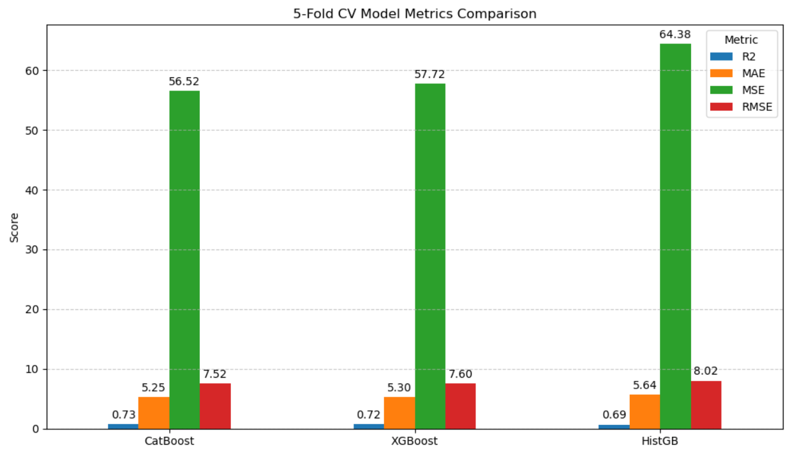
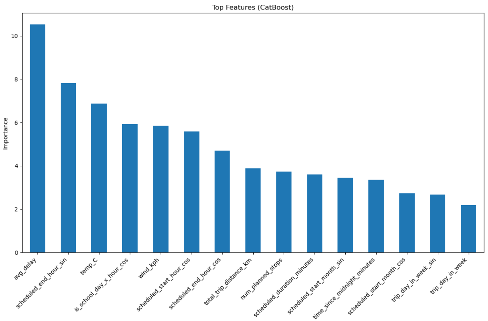
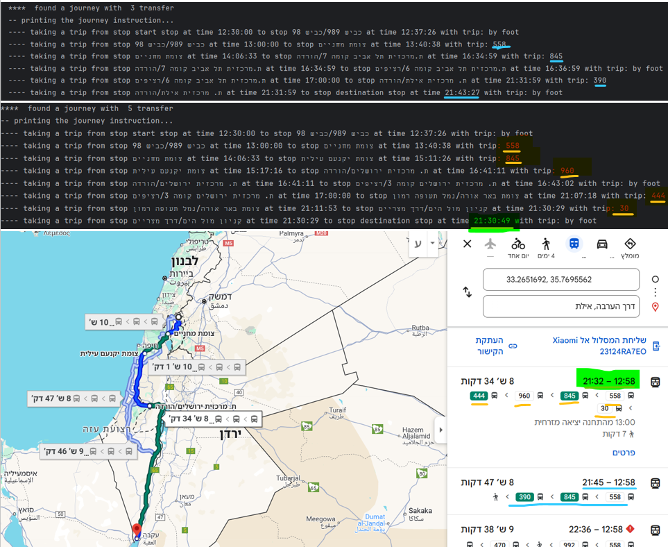
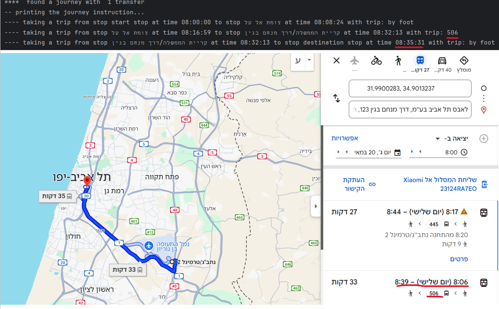

# Pulic Transport Navigator and Latency Prediction Model

This project integrates a high-performance offline public transportation routing system (OttoTo_PTN) with a sophisticated trip latency prediction model (CatBoost) for Tel-Aviv. Together, these components offer a robust solution for navigating public transit and understanding potential delays, leveraging real-world GTFS data, historical trip information, and weather patterns.

## Visual Highlights

The following images showcase the capabilities of the system, comparing routing results with established services and visualizing model performance for latency prediction.
**Tel-Aviv Latency Prediction - Model Insights**

*Figure 1: Model Performance Comparison, evaluating different machine learning models for trip delay prediction.*
*As observed, CatBoost outperforms all other models across all evaluation metrics. Therefore, it was selected as the final model.*

*Figure 2: Feature Importance plot, revealing key factors influencing trip delay predictions based on data known in advance.*

**OttoTo_PTN: Public Transport Navigator - Routing Examples**

*Figure 3: OttoTo_PTN vs. Google Maps for a journey from Mount Hermon to Eilat, demonstrating detailed route breakdown.*

*Figure 4: OttoTo_PTN vs. Google Maps for a journey from Ben Gurion Airport to Tel Aviv, highlighting transfers and walking segments.*

---

## Part 1: OttoTo_PTN - Public Transport Navigator

OttoTo_PTN is a high-performance offline public transportation routing system designed to compute optimal journeys in public transit networks. It is based on the RAPTOR (Round-based Public Transit Routing) algorithm, known for its speed and efficiency, and processes GTFS (General Transit Feed Specification) for transit data.

**Comparison to Google Maps**
As shown in Figures 3 and 4, OttoTo_PTN achieves comparable routing results to services like Google Maps in terms of accuracy and efficiency, while being specifically tailored for use cases such as custom transit networks or offline routing scenarios.

### Key Features of OttoTo_PTN
* **RAPTOR Algorithm**: Implements the RAPTOR algorithm to compute the fastest routes with minimal transfers.
* **GTFS Data Integration**: Processes GTFS data to extract stops, routes, trips, and schedules.
* **Preprocessing Pipeline**: Efficiently preprocesses transit data to optimize runtime performance.
* **Geohashing for Spatial Indexing**: Uses geohashing to group stops spatially for quick lookups.
* **Dynamic Footpath Handling**: Calculates walking paths between stops for seamless integration with public transit.
* **Edge Case Handling**: Manages scenarios like walking-only journeys for short distances, trips spanning midnight, or very long walks to reach a stop.

### How OttoTo_PTN Works

**1. RAPTOR Algorithm**
The RAPTOR algorithm is a round-based public transit routing algorithm that iteratively explores routes and stops to compute optimal journeys. It is designed to:
* Minimize travel time.
* Minimize the number of transfers.
* Efficiently prune suboptimal paths to improve performance.

**2. GTFS Data**
GTFS (General Transit Feed Specification) is a standard format for public transportation schedules and associated geographic information. OttoTo_PTN utilizes GTFS files to extract:
* **Stops**: Locations where passengers can board or alight.
* **Routes**: Paths taken by transit vehicles.
* **Trips**: Specific instances of routes with schedules.
* **Stop Times**: Arrival and departure times for each stop.
* **Calendar**: Service availability based on days and dates.

**3. Preprocessing**
To optimize runtime performance, OttoTo_PTN preprocesses GTFS data into efficient data structures. The preprocessing steps include:
* **Building Trip Stops**: Extracting stops for each trip from `stop_times.txt`.
* **Service Mapping**: Mapping service IDs to their active days and date ranges using `calendar.txt`.
* **Stop Data Construction**: Parsing stop names, locations, and geohashes from `stops.txt`.
* **Route Aggregation**: Grouping trips with identical stop sequences into routes.
* **Footpath Generation**: Calculating walking paths between nearby stops using geohashing and haversine distance.
This pipeline ensures that the routing engine can quickly access and process the required data during runtime.

### Example Usage (OttoTo_PTN)

* **Input**:
    * Start Location: Latitude and longitude of the starting point.
    * End Location: Latitude and longitude of the destination.
    * Departure Time: Desired departure time.
* **Output**:
    * Optimal Journey: A detailed plan including stops, trips, walking segments, and transfer details (as illustrated in Figures 1 and 2).

---

## Part 2: Tel-Aviv Latency Prediction with Weather and Historical Data

This component of the project focuses on predicting trip delays in Tel-Aviv using a combination of weather data, historical trip information, and engineered cyclical features. The goal is to provide accurate delay forecasts based solely on data known in advance. The visualizations in Figures 1 and 2 highlight the model evaluation and key predictive factors.

### Feature Engineering for Latency Prediction

**1. Cyclical Features**
Certain features, such as time of day and month, exhibit cyclical patterns (e.g., December is closer to January than to May). To preserve these properties, sine and cosine transformations are applied, normalized by $ \frac{2\pi}{\text{max\_value}} \times \text{value} $. This allows the model to capture the cyclical nature effectively.

**2. Aggregated Features**
* **`avg_speed`**: The average speed for each route, calculated from historical trip data, offering insights into typical travel speeds.
* **`avg_delay`**: The average delay for each route, computed from historical data, capturing route reliability.
* **`is_rush_hour`**: A binary feature indicating if a trip occurs during peak traffic hours (e.g., 7-9 AM, 4-7 PM).
* **`is_school_day`**: A binary feature indicating if a trip occurs on a school day, accounting for school schedule impacts.

**3. Weather Features**
Weather conditions (temperature, precipitation, wind speed) are integrated to account for their significant impact on trip delays. For example, rain or strong winds can slow traffic, and extreme temperatures might affect vehicle performance.

### Feature Categories Utilized

* **Categorical Features**:
  `ClusterId`, `Direction`, `LineAlternative`, `route_route_short_name`, `route_route_type`, `route_direction`, `is_rush_hour`, `is_school_day`
* **Numerical Features**:
  `trip_day_in_week`, `total_trip_distance_km`, `num_planned_stops`, `temp_C`, `precip_mm`, `wind_kph`, `trip_month`, `scheduled_start_hour`, `scheduled_start_minute`, `scheduled_end_hour`, `scheduled_end_minute`, `scheduled_start_hour_sin`, `scheduled_start_hour_cos`, `scheduled_end_hour_sin`, `scheduled_end_hour_cos`, `trip_day_in_week_sin`, `trip_day_in_week_cos`, `avg_delay`, `avg_speed`, `scheduled_start_month_sin`, `scheduled_start_month_cos`, `scheduled_start_minute_sin`, `scheduled_start_minute_cos`, `scheduled_end_minute_sin`, `scheduled_end_minute_cos`, `time_since_midnight_minutes`, `scheduled_duration_minutes`, `is_rush_hour_x_hour_cos`, `is_rush_hour_x_hour_sin`, `is_school_day_x_hour_cos`, `is_school_day_x_hour_sin`

### Machine Learning Models for Latency Prediction

Several machine learning models were implemented and evaluated:
* **XGBoost**: Gradient boosting with decision trees.
* **CatBoost**: Gradient boosting optimized for categorical features.
* **Histogram-based Gradient Boosting**: A variant using histograms for faster training.

### Key Functions in Latency Prediction
* **`add_weather_features`**: Integrates weather data based on trip start and end times.
* **`add_recent_delay_feature`**: Calculates mean delay of previous trips on the same line/direction within a time window.
* **`add_cyclical_features`**: Transforms time-based features into cyclical sine/cosine representations.

### Evaluation Metrics for Latency Prediction
Models were evaluated using:
* **R² Score**: Proportion of variance explained.
* **Mean Absolute Error (MAE)**: Average absolute difference between predicted and actual values.
* **Mean Squared Error (MSE)**: Average squared difference.
* **Root Mean Squared Error (RMSE)**: Square root of MSE, in the same units as the target.

### Latency Prediction Results
The **CatBoost model** achieved the best performance, as shown in Figure 3, with the following metrics:
* **R² Score**: $0.741$
* **MAE**: $5.23$ minutes
* **MSE**: $52.34$
* **RMSE**: $7.23$ minutes

The feature importance plot (Figure 4) details the most influential factors in these predictions.

---

## Future Work
Potential enhancements for the latency prediction model include:
* Incorporating additional weather features (e.g., humidity, visibility).
* Experimenting with deep learning models for time-series forecasting.

## Acknowledgments
This project leverages open-source libraries and datasets, including:
* XGBoost, CatBoost, and scikit-learn for machine learning.
* Meteostat for accessing historical weather data.
* GTFS Israel for public transit schedule and route information.
* Historical data from the Israel Public Transit Office for trip and delay analysis.
